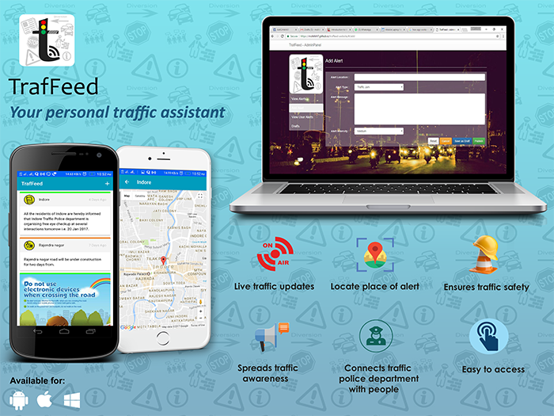
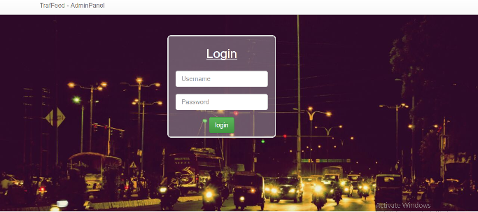
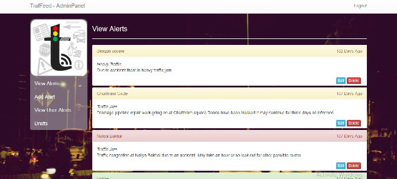
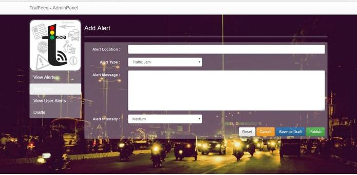

# Traffeed-website
The Admin panel for the Traffeed App - Your Personal Traffic Assistant

## Screenshots
+ ##### Login Page

+ ##### View Alerts

+ ##### Add Alerts

## How it Works
It is an web based admin panel of traffed app. It is used to feed and manage feed of traffeed App.
Admin panel website is built using Angular JS and Bootstrap framework and hosted on Github pages. For the database of feeds we have used Google Firebase Database along with AngularFire.

## Credentials 
+ Username - admin
+ Password - 123456

## Credits 
+ Background Image - [Harshal Nimje](https://www.facebook.com/harshal.nimje "Facebook Profile")

